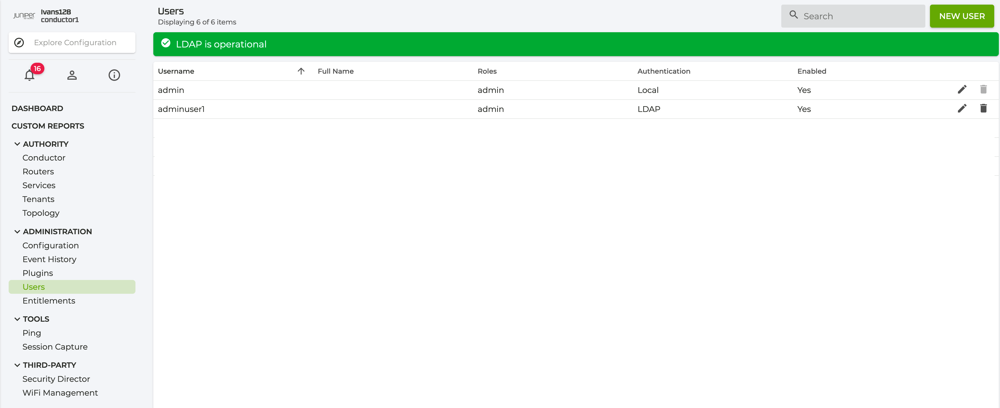
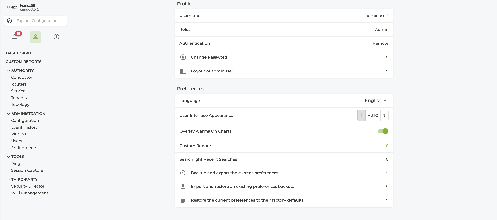

# OpenLDAP docker image for testing 128T LDAP authentication

This image provides an OpenLDAP Server for testing 128T with LDAP authentication.

By default, the server is initialized with the domain `t128.local` with set of posix users/groups.


The starting point is based on [docker-test-ldap](https://github.com/rroemhild/docker-test-openldap)

Slapd configuration is minimal and the container does not store any data in persistent volumes. Sample data is bootstrapped each time the container is created and lost everytime you remove it.

## Some Features

* Support for TLS
* Initialized on container start with default data
* Initialized on container start with provided ldap.conf
* Image size ~110-120MB (~30MB compressed)

## Usage

Get the image locally

```bash
docker pull j5j5/openldap-t128-basic
```

### Launching with default data

By default the container has a basic default data that can be used for testing.
Launch the container with the default data
```bash
# Use access from other container on a docker network
docker run -d --name openldap-t128-basic --network bridge j5j5/openldap-t128-basic
# Access the slapd container from localhost or other host on the network
docker run -d -p 389:389 -p 636:636 --name openldap-t128-basic j5j5/openldap-t128-basic
# or acess it from the localhost
docker run -d --name openldap-t128-basic --network host j5j5/openldap-t128-basic
```

### Customizing the container

You can customize the data used to initialize this image instance through variables and custom volume mounts for specific files.


#### Bootstrap config and data.

To override the DB and configuration files, simply bind mount your custom files from your local filesystem to the container. If needed you can change the default `/bootstrap` directory location on the container by setting variable `$BOOTSTRAP_DIR`

```bash
# override data only
docker run -d --name openldap-t128-basic -v /path/to/my/data.ldif:/bootstrap/data.ldif j5j5/openldap-t128-basic

# override both data and config
docker run -d --name openldap-t128-basic -v /path/to/my/bootstrap_dir:/bootstrap j5j5/openldap-t128-basic

# override both on a custom location
docker run -d --name openldap-t128-basic -v /path/to/my/bootstrap_dir:/customdir -e BOOTSTRAP_DIR=/customdir j5j5/openldap-t128-basic
```

## Exposed ports

* 389 (ldap://)
* 636 (ldaps://)


## Testing

LDAPTLS_REQCERT=never ldapsearch -H ldaps://localhost:636 -D cn=admin,dc=t128,dc=local -b dc=t128,dc=local -x '(&(uid=user3)(objectclass=posixAccount)(&(uidNumber=*)(!(uidNumber=0))))' -v -W
LDAPTLS_REQCERT=never ldapsearch -H ldaps://localhost:636 -D cn=admin,dc=t128,dc=local -b dc=t128,dc=local -x '(&(gidNumber=15003)(objectClass=posixGroup)(cn=*)(&(gidNumber=*)(!(gidNumber=0))))' -v -W
ldapsearch -H ldaps://localhost:636 -D cn=admin,dc=t128,dc=local -b dc=t128,dc=local -x '(&(memberuid=user3)(objectClass=posixGroup)(cn=*)(&(gidNumber=*)(!(gidNumber=0))))' -v -W

LDAPTLS_REQCERT=never ldapsearch -H ldaps://localhost:636 -D cn=admin,dc=t128,dc=local -b dc=t128,dc=local -x '(&(memberuid=user3)(objectClass=posixGroup)(cn=*)(&(gidNumber=*)(!(gidNumber=0))))' -v -W

Filters:
(&(uid=adminuser1)(objectclass=posixAccount)(uid=*)(&(uidNumber=*)(!(uidNumber
=0))))
(&(uid=adminuser1)(objectclass=posixAccount)(&(uidNumber=*)(!(uidNumber=0))))
(&(memberuid=adminuser1)(objectClass=posixGroup)(cn=*)(&(gidNumber=*)(!(gidNum
ber=0))))
(&(gidNumber=9996)(objectClass=posixGroup)(cn=*)(&(gidNumber=*)(!(gidNumber=0))))


## Debug

To verify that accounts are in the right groups
```bash
id -Gn <user-name>

$id -Gn adminuser1
128t-admin admins
$id -Gn user1
128t-user users
```

or id <user-name>

```bash
$id adminuser1
uid=10001(adminuser1) gid=9996(128t-admin) groups=9996(128t-admin),9998(admins)
$id user1
uid=15001(user1) gid=9997(128t-user) groups=9997(128t-user),9999(users)
```

## Special configs

### Debug level

Increase debug level of SSSD daemon in config file /etc/sssd/sssd.conf located in 128T Conductor

```bash
[domain/t128local]
debug_level = 9
```

the debug file is located by default in /var/log/sssd/

### TLS/SSL error

In case of TLS/SSL error:
(Sun May 30 20:53:45 2021) [sssd[be[t128local]]] [sdap_connect_done] (0x0080): ldap_install_tls failed: [Connect error] [error:14090086:SSL routines:ssl3_get_server_certificate:certificate verify
 failed (self signed certificate)]

To skip TLS/SSL certificate verification:

```bash
[domain/t128local]
ldap_tls_reqcert = never
```

Note: On every Conductor upgarde this line must be added to the sssd configuration file and servie restarted
```bash
vi /etc/sssd/sssd.conf
service sssd restart
```

### Cache cleanup

sss_cache -u <user>


## Default LDAP structure

All users have the same password: `Poiuyt123`

```
dc=t128,dc=local
|    cn=admin,dc=t128,dc=local
|
└─── ou=people,dc=t128,dc=local
|    |    uid=adminuser1,ou=people,dc=t128,dc=local
|    |    uid=adminuser2,ou=people,dc=t128,dc=local
|    |    uid=user1,ou=people,dc=t128,dc=local
|    |    uid=user2,ou=people,dc=t128,dc=local
|    |    uid=user3,ou=people,dc=t128,dc=local
|    |    uid=user4,ou=people,dc=t128,dc=local
|
└─── ou=groups,dc=t128,dc=local
     |
     └─── cn=128t-admin,ou=groups,dc=t128,dc=local
     |    |    memberUID:adminuser1
     |    |    memberUID:adminuser2
     |
     └─── cn=128t-user,ou=groups,dc=t128,dc=local
          |    memberUID:user1
          |    memberUID:user2
          |    memberUID:user3
          |    memberUID:user4
```


## 128T Configuration

ldap-server t128local
  name                t128local
  address             192.168.251.15
  search-base         dc=t128,dc=local
  server-type         ldaps
  bind-type           password
  distinguished-name  cn=admin,dc=t128,dc=local
  password            (removed)
exit

The embedded password for the admin user is My128TAdminPass and that is the one that needs to be configured in the Conductor

## Screenshots

### Users screen after LDAP configuration


### Login with LDAP user


### LDAP user logged in

